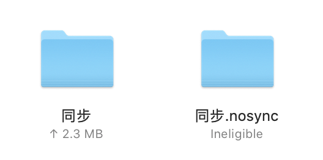
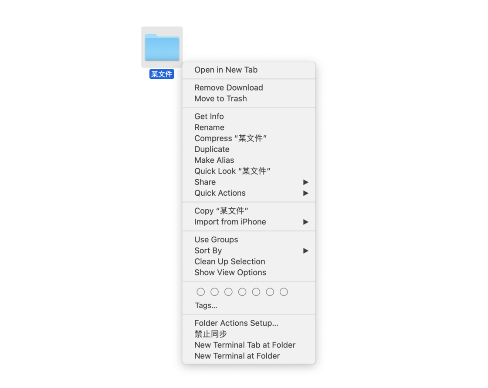

# 如何阻止 iCloud 同步指定文件夹？

使用 iCloud 的过程中，难免遇到有些文件夹你不希望同步。iCloud 的持续同步机制会使得这些文件夹中的部分文件持续处于被上传且不可用状态。

## 解决方法

这时你只需要重命名你不希望同步的文件夹，**给他的文件名加上一个「.nosync」即可**。如下图，我们把这个东西叫做旗标，用来告知 iCloud 不要碰这个文件夹及其子文件。
如下图所示，标注后的文件夹会显示 iCloud 不可用，正是我们想要的。若你希望其再次同步，删除「.nosync」即可。

## 右键快捷菜单

若你不想每次手动添加，我制作了一个工作流插件，自动重命名它。只要将其拖动至「~/Library/Services」文件夹即可。
[下载工作流文件](https://pan.baidu.com/s/1vaJcejP7y2nBWcgPol15ug) 提取码: n5vw
这时你会看到右键菜单中多出来一个「禁止同步」的选项，点击即可自动为该文件夹添加「.nosync」旗标以禁止同步。若要恢复其同步，同理重命名并删除旗标即可。

## 写在最后

有些工程文件对文件名比较敏感，直接重命名根文件夹可能会导致一些文件查找错误，建议先在 iCloud 中创建一个禁止同步的文件夹，以后把你不希望同步的文件夹放在这里，更稳妥。
